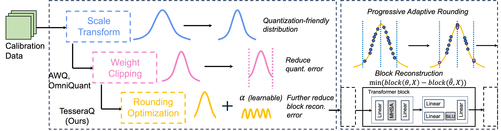

# TesseraQ: Ultra Low-Bit LLM Post-Training Quantization with Block Reconstruction



[](https://arxiv.org/abs/2405.06001)


**TesseraQ** is a block reconstruction-based PTQ algorithm for Large Language Models, achieving state-of-the-art uniform quantization performance under INT2/INT3/INT4 format. 


## News

* **Oct 27, 2024:** 🍺🍺🍺 We release our arXiv paper:

  [**TesseraQ: Ultra Low-Bit LLM Post-Training Quantization with Block Reconstruction**](https://arxiv.org/abs/2405.06001).


* **Oct 25, 2024:** The LLMC framework has integrated TesseraQ. 

## Highlight Features

* We integrate our method into the [LLMC](https://github.com/ModelTC/llmc/tree/main) framework, which can easily combined with existing PTQ algorithm them. It also allows easy comparisons across different algorithms/models.💥 
* Easy initialization from [AWQ](https://arxiv.org/pdf/2306.00978), [OmniQuant](https://arxiv.org/pdf/2308.13137), or [QuaRot](https://arxiv.org/pdf/2404.00456) for both weight-only quantization, and weight-activation quantization. 💥
* Compatible to original LLMC to export TesseraQ models to various quantization backends, including `Huggingface`, `LightLLM`, `AutoAWQ`, `vLLM`, `GPTQModel` for reduced memory footprint and faster inference. 💥

## Usage

Our method has also been integrated into the official release of LLMC, feel free to use our method there!

1. Clone this repository and install packages:

   ```shell
   # install packages
   cd llmc
   pip install -r requirements.txt
   ```

2. Prepare models and data. 

   ```shell
   # After downloading LLMs from huggingface, prepare calibration and evaluation data as follows:
   cd tools
   python download_calib_dataset.py --save_path [calib data path]
   python download_eval_dataset.py --save_path [eval data path] 
   ```

3. Choose a model and quantize it with TesseraQ:

   ```shell
   # Here's an example about LLaMA-2-7B model with W2A16g128 quantization:
   cd scripts
   # Modify the path of llmc, ``llmc_path``, in the bash file. You can also choose one config 
   # placed in ``llmc/configs/quantization/Awq/`` to quantize your model, or your own
   # config referring to those we provide by changing the ``--config`` argument in run_awq_llama.sh.
   bash run_awq_llama.sh
   bash run_tesseraq_llama.sh
   ```

## Running Scripts

We provide the running scripts to reproduce our experiments.  

### LLaMA-2 with Perplexity Evaluation

```shell
cd scripts
sh run_llama2.sh
```

| Model     | 7B                                                 | 13B                                                 | 70B                                                 |
|-----------|----------------------------------------------------|-----------------------------------------------------|-----------------------------------------------------|
| W2A16     | [8.05](./configs/llama2/tesseraq_w2_L2_7b.yml)     | [6.55](./configs/llama2/tesseraq_w2_L2_13b.yml)     | [5.26](./configs/llama2/tesseraq_w2_L2_70b.yml)     |
| W2A16g128 | [6.82](./configs/llama2/tesseraq_w2g64_L2_7b.yml)  | [5.92](./configs/llama2/tesseraq_w2g64_L2_13b.yml)  | [4.73](./configs/llama2/tesseraq_w2g64_L2_70b.yml)  |
| W2A16g64  | [6.67](./configs/llama2/tesseraq_w2g128_L2_7b.yml) | [5.81](./configs/llama2/tesseraq_w2g128_L2_13b.yml) | [4.60](./configs/llama2/tesseraq_w2g128_L2_70b.yml) |
| W3A16     | [5.84](./configs/llama2/tesseraq_w3_L2_7b.yml)     | [5.16](./configs/llama2/tesseraq_w3_L2_13b.yml)     | [3.68](./configs/llama2/tesseraq_w3_L2_70b.yml)     |
| W3A16g128 | [5.71](./configs/llama2/tesseraq_w3g128_L2_7b.yml) | [5.11](./configs/llama2/tesseraq_w3g128_L2_13b.yml) | [3.61](./configs/llama2/tesseraq_w3g128_L2_70b.yml) |
| W4A16     | [5.56](./configs/llama2/tesseraq_w4_L2_7b.yml)     | [4.96](./configs/llama2/tesseraq_w4_L2_13b.yml)     | [3.40](./configs/llama2/tesseraq_w4_L2_70b.yml)     |

(Note that the above srcipts can also be used to reproduce LLaMA-7B/13B/30B/66B models)

### LLaMA-3.1 with Downstream Tasks Evaluation

```shell
cd scripts
sh run_llama3_1.sh
```

| Model     | 8B                                                     | 70B                                                     |
|-----------|--------------------------------------------------------|---------------------------------------------------------|
| W2A16g128 | [59.37](./configs/llama3_1/tesseraq_w2g128_L31_8b.yml) | [66.76](./configs/llama3_1/tesseraq_w2g128_L31_70b.yml) |
| W3A16g128 | [67.36](./configs/llama3_1/tesseraq_w3g128_L31_8b.yml) | [74.09](./configs/llama3_1/tesseraq_w3g128_L31_70b.yml) |

### LLaMA-3.2 for Edge Device

```shell
cd scripts
sh run_llama3_2.sh
```

| Model        | Method   | Bit    | Wiki ppl. | Avg. Acc | Scripts                                               |
|--------------|----------|--------|-----------|----------|-------------------------------------------------------|
| LLaMA-3.2-1B | Pretrain | FP16   | 9.75      | 56.50    | -                                                     |
| LLaMA-3.2-1B | AWQ      | W2g128 | 5475      | 35.42    | [here](./configs/llama3_2/awq_w2g128_L32_1b.yml)      |
| LLaMA-3.2-1B | TesseraQ | W2g128 | 18.61     | 43.36    | [here](./configs/llama3_2/tesseraq_w2g128_L32_1b.yml) |
| LLaMA-3.2-1B | AWQ      | W3g128 | 16.69     | 49.85    | [here](./configs/llama3_2/awq_w3g128_L32_1b.yml)      |
| LLaMA-3.2-1B | TesseraQ | W3g128 | 11.08     | 53.24    | [here](./configs/llama3_2/tesseraq_w3g128_L32_1b.yml) |
| LLaMA-3.2-1B | AWQ      | W4g128 | 10.85     | 54.68    | [here](./configs/llama3_2/awq_w4g128_L32_1b.yml)      |
| LLaMA-3.2-1B | TesseraQ | W4g128 | 10.09     | 54.98    | [here](./configs/llama3_2/tesseraq_w4g128_L32_1b.yml) |
| LLaMA-3.2-3B | Pretrain | FP16   | 7.81      | 63.57    | -                                                     |
| LLaMA-3.2-3B | AWQ      | W2g128 | 495.2     | 38.15    | [here](./configs/llama3_2/awq_w2g128_L32_3b.yml)      |
| LLaMA-3.2-3B | TesseraQ | W2g128 | 11.94     | 51.53    | [here](./configs/llama3_2/tesseraq_w2g128_L32_3b.yml) |
| LLaMA-3.2-3B | AWQ      | W3g128 | 10.21     | 59.94    | [here](./configs/llama3_2/awq_w3g128_L32_3b.yml)      |
| LLaMA-3.2-3B | TesseraQ | W3g128 | 8.45      | 61.58    | [here](./configs/llama3_2/tesseraq_w3g128_L32_3b.yml) |
| LLaMA-3.2-3B | AWQ      | W4g128 | 8.25      | 62.83    | [here](./configs/llama3_2/awq_w4g128_L32_3b.yml)      |
| LLaMA-3.2-3B | TesseraQ | W4g128 | 7.96      | 63.63    | [here](./configs/llama3_2/tesseraq_w4g128_L32_3b.yml) |


## Configuration

To help users design their configs, we now explain some universal configurations in all configs we provide under ``llmc/configs/``:

* ``model``:

  ```yaml
  model:
      # Replace by the name of the class in ``llmc/models/*.py``.
      type: Llama
      # We set the path to LLaMA-2-7B. 
      path: meta-llama/Llama-2-7b-hf
      torch_dtype: auto
  ```

* ``calib``: 

  ```yaml
  # Note: some algorithms do not need ``calib``, like naive... So, you can remove this part.
  calib:
      # Replace by the calibration data name, e.g., pileval, c4, wikitext2, or ptb, downloaded before.
      name: c4
      download: False
      # Replace by the path of one of the calibration data, e.g., pileval, c4, wikitext2, or ptb, 
      # downloaded before.
      path: calib data path       # ../cache/data/calib/c4
      n_samples: 512
      bs: 1
      seq_len: 2048
      # Replace by the function name in ``llmc/data/dataset/specified_preproc.py``.
      preproc: c4_gptq  
      seed: *seed
  ```

* ``eval``:

  ```yaml
  # If you want to evaluate PPL of your pretrained/transformed/fake_quant model.
  eval:
      # You can evaluate the pretrain, transformed, fake_quant model, and set the position 
      # you want to evaluate.
      eval_pos: [pretrain, transformed, fake_quant]
      # Replace by the name of the eval data, e.g., c4, wikitext2, ptb or [c4, wikitext2],
      # downloaded before.
      name: [wikitext2, c4]
      download: False
      path: eval data path
      # For 70B model eval, bs can be set to 20, and inference_per_block can be set to True.
      # For 7B / 13B model eval, bs can be set to 1, and inference_per_block can be set to False.
      bs: 1
      inference_per_block: False
      seq_len: 2048
  ```

* ``save``:

  ```yaml
  save:
      # ``save_fp`` is True, which means you want to export the transformed model, e.g., parameter-modified
      # model, whose performance and structure are the same as the original model, and users can 
      # utilize naive quantization to the transformed model to obtain the same performance as 
      # the specifical-algorithm-quantized model.
      save_fp: False
      # ``save_lightllm`` is True, which means you want to export a real quant model, e.g.,
      # low-bit weights with weight and activation quantization parameters.
      save_lightllm: False
      # ``save_fake`` is True means you want to export fake_quant model, e.g.,
      # dequantized weight with activation quantization parameters.
      save_fake: False
      save_path: ./save
  ```

  

* ``quant``:

  ```yaml
  quant:
      # Replace by the class name in ``llmc/compression/quantization/*.py``
      method: TesseraQ
      # weight-only quantization does not have ``act`` part.
      weight:
          bit: 2
          symmetric: False
          # Quantization granularity: per_channel, per_tensor, per_head (not recommanded).
          granularity: per_group
          group_size: 128          # set to -1 if per_channel
          # Calibration algorithms: learnble, mse, and minmax (default).
          calib_algo: minmax
      # specify an `act` quantization configuration here for weight activation quantization
      
      # This part is designed for specific algorithms, thus we define the TesseraQ calibration parameters here
      special:
          lr: 0.001             # learning rate for rounding variables
          iterations: 250       # training iterations for each round of PAR
          wd: 0.0               # weight decay, set to 0
          batch_size: 4         # batch size for calibration
          deactive_amp: False   # use fp16 training if False
          aug_loss: False       # legacy parameters from OmniQuant, always False
          optimize_scale: True  # enabling dequantize scale tuning
          scale_lr: 0.001       # learning rate for dequantize scale tuning, set to same with rounding
          # handcrafted thresholds change during PAR
          thresholds: [0.8, 0.65, 0.5, 0.43, 0.38, 0.34, 0.3, 0.27, 0.24, 0.21, 0.18, 0.15, 0.12, 0.10, 0.08,
                      0.06, 0.04, 0.02, 0.01, 0.005]      
          weight_clip: True     # for online clipping weights or loading AWQ/OMNIQUANT clips
          load_transform: True  # for online loading AWQ scale transformations
          # used together with `weight_clip`, v1 is for online clipping, v2 is for loading pretrained clips.
          clip_version: v1      
          reduce_memory: True   # restore block to fp16 after calibration, help reduce CPU memory
          # path to saved transformation scales or weight clipping values
          scale_path: ../cache/activations/L2_7b/awq_w2g128          
          clip_path: ../cache/activations/L2_7b/awq_w2g128
          # parameters with QuaRot initialization, set to True if use QuaRot models
          online_rotate: False
          fp32_had: False
      # If quant_out is True, employ the outputs of the former quantized block as the 
      # calibration data of the proceeding block.
      quant_out: True          # always True for TesseraQ

  ```

## Calibration Pipeline

### AWQ 
There are two ways to apply AWQ initialization for TesseraQ. The first one is saving the AWQ transformation/scales and
then apply them on the fly before TesseraQ calibration in each block. The second method is to directly save the transformed
LLM checkpoint and reload it for TesseraQ.

For the first method, please set the `save_scale` and `save_clip` to True and specify the saved path for them in the AWQ 
configuration, for example:

```yaml
        save_scale: True
        clip_version: v2
        scale_path: ../cache/activations/L2_7b/awq_w2g128
        save_clip: True
        clip_path: ../cache/activations/L2_7b/awq_w2g128
```
Then, for the TesseraQ configuration, enable `load transform` and `weight_clip` and specify the saved path of clips/scales. 
```yaml
        weight_clip: True
        load_transform: True
        clip_version: v2
```
Note that when `clip_version=v2`, the `calib_algo` of weight quantization should be set to `learanable`. 
If we choose `clip_version=v1`, TesseraQ will perform AWQ weight clipping on-the-fly instead of load the saved clips,
and may achieve better perplexity results in low bit case.

For the second method, be aware to use `clip_version=v1` and then simply enable the `save_transformed` in AWQ configuration. 
Next, we change the path `model/path` in TesseraQ configurations without enabling `load_transform` or `weight_clip`. 


### OmniQuant 

Since OmniQuant only optimizes the clipping values in weights for LLaMA weight only quantization. It's easy to use their 
pretrained values. 
First, download the pretrained OmniQuant clips [here](https://huggingface.co/ChenMnZ/OmniQuant/tree/main) and then specify 
the parameters in TesseraQ configuration
```yaml
        weight_clip: True
        load_transform: False      # no scale transformation in OmniQuant-LLaMA
        clip_version: v2
        clip_path: ../cache/activations/L2_7b/omniq_w2
```
Note that in most cases we observe AWQ initialization is better than OmniQuant except for W2A16 per-channel quantization. 


### QuaRot

We recommend saving the QuaRot checkpoint and reload it for TesseraQ quantization since QuaRot transformation can be done once 
and used for all bitwidth settings. To do so, simply enable the `save_transformed` in QuaRot configuration.
Then load the saved checkpoint for TesseraQ and enable `online_rotate` as well as `fp32_had` in the configuration.


## Citation

If you find our LLM-QBench paper/llmc toolkit useful or relevant to your research, please kindly cite our paper:
